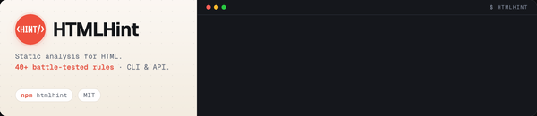
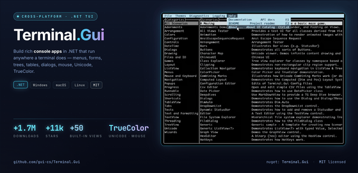
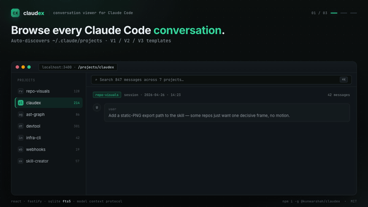
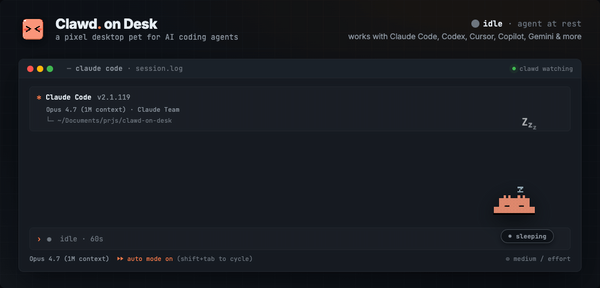
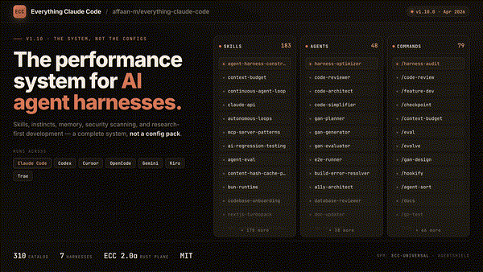
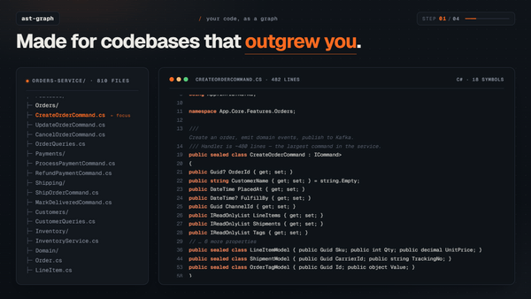

# livlign skills


Claude Code plugins for open-source maintainers — designing README heroes, auditing READMEs, and backfilling trustworthy .NET test coverage.

Featured in [**rohitg00/awesome-claude-code-toolkit**](https://github.com/rohitg00/awesome-claude-code-toolkit) — the curated list of Claude Code plugins, agents, and MCP servers.

```
/plugin marketplace add livlign/claude-skills
```

> Already added the marketplace? Run `/plugin marketplace update livlign` to pick up newly-published plugins (e.g. `dotnet-coverage-kit`) and version bumps.

### Recent heroes shipped

Thumbnails — click through to see the live hero in each repo.

<table>
<tr>
<td width="50%" valign="top">
  <sub><a href="https://github.com/htmlhint/HTMLHint"><b>htmlhint/HTMLHint</b></a></sub>
  <a href="https://github.com/htmlhint/HTMLHint"></a>
</td>
<td width="50%" valign="top">
  <sub><a href="https://github.com/gui-cs/Terminal.Gui"><b>gui-cs/Terminal.Gui</b></a></sub>
  <a href="https://github.com/gui-cs/Terminal.Gui"></a>
</td>
</tr>
<tr>
<td width="50%" valign="top">
  <sub><a href="https://github.com/kunwar-shah/claudex"><b>kunwar-shah/claudex</b></a></sub>
  <a href="https://github.com/kunwar-shah/claudex"></a>
</td>
<td width="50%" valign="top">
  <sub><a href="https://github.com/rullerzhou-afk/clawd-on-desk"><b>rullerzhou-afk/clawd-on-desk</b></a></sub>
  <a href="https://github.com/rullerzhou-afk/clawd-on-desk"></a>
</td>
</tr>
<tr>
<td width="50%" valign="top">
  <sub><a href="https://github.com/affaan-m/everything-claude-code"><b>affaan-m/everything-claude-code</b></a></sub>
  <a href="https://github.com/affaan-m/everything-claude-code"></a>
</td>
<td width="50%" valign="top">
  <sub><a href="https://github.com/emtyty/ast-graph"><b>emtyty/ast-graph</b></a></sub>
  <a href="https://github.com/emtyty/ast-graph"></a>
</td>
</tr>
</table>

[Full showcase →](./plugins/repo-visuals/SHOWCASE.md)

---

## Plugins

| Plugin | Install | What it does |
|---|---|---|
| [repo-visuals](./plugins/repo-visuals) | `/plugin install repo-visuals@livlign` | Designs bespoke README hero visuals — animated GIF, static PNG, or animated SVG — through a structured discovery dialog. |
| [repo-doctor](./plugins/repo-doctor) | `/plugin install repo-doctor@livlign` | Audits a repo's README against best-practice patterns and produces a prioritized P0/P1/P2 punch list of fixes. |
| [dotnet-coverage-kit](./plugins/dotnet-coverage-kit) | `/plugin install dotnet-coverage-kit@livlign` | Backfills characterization + spec unit tests into .NET services and keeps C0/C1 coverage honest via a checked-in manifest and a CI gate. |

---

## `repo-visuals`

Scans the target repo, recommends a format that fits its identity, proposes scenarios, designs a bespoke HTML stage, previews it in your browser, and exports a retina-quality artifact — then optionally opens the upstream PR.

**What a run looks like:**

```
> /repo-visuals
  pick mode → semi-auto · scan repo → 30 tools detected
  recommend → animated GIF, 1200×675 · brief locked
  build HTML → preview in browser → ship
  export → hero.gif (2.4 MB) · open PR #42
```

**Why it's different**

- **Discovery dialog, not templates.** Every hero is bespoke. A structured scan-then-design conversation runs before any HTML is written.
- **Production-grade by default.** Retina capture, drift-proof copy (no stale star counts or version numbers), preview-vs-export parity, scope-match guardrails — encoded from real maintainer pushback.
- **Three modes.** Manual, Semi-auto (recommended), Auto.
- **Optional PR.** Local-only or full upstream PR with relative-path embed, alt-text generation, and fork-and-PR for repos you don't own.

[Skill source →](./plugins/repo-visuals)

---

## `repo-doctor`

Audits a README the way a senior maintainer would — does the "what is this" sentence land, is install-to-first-success short enough, does the audience-jargon match, are there drift signals (stale versions, badge sprawl, dead links). Read-only diagnostic by default; opens a PR only on explicit ask.

**What a run looks like:**

```
> /readme-doctor
  scan repo → classify category (CLI tool · library · framework · …)
  audit → score 9 criteria with evidence
  output → P0/P1/P2 punch list, each with a one-line fix
  health score: 69/100
```

[Skill source →](./plugins/repo-doctor)

---

## `dotnet-coverage-kit`

Backfills unit tests into legacy .NET services and keeps coverage honest. It classifies every file **per method** — so a controller or a DbContext-bound god-class still contributes its testable slice instead of being written off wholesale — writes characterization tests for old code and spec tests for new, and measures deterministic C0/C1 via dotnet-coverage. A checked-in manifest explains why every file is tested, excluded, or can't-be-tested (each with a mitigation), and a CI gate (diff coverage + ratchet + scope guard) stops it slipping.

**What a run looks like:**

```
> /coverage-init
  detect projects → parallel sweep classifies every file (per-method carve-outs)
  draft manifest → self-critique loop → you confirm only the gray areas
> /generate-tests
  characterize old code · spec new code → 100% of testable branches
  genuinely untestable → manifest entry with a reason + mitigation
> /coverage-report
  deterministic C0/C1 → merge sets the baseline → CI gate on every PR
```

[Plugin source →](./plugins/dotnet-coverage-kit)

---

## Contributing

Easiest entry points: submit a hero to the [showcase](./plugins/repo-visuals/SHOWCASE.md), report a real failure as an issue, or pick something from the [wishlist](./CONTRIBUTING.md#3-pick-something-from-the-wishlist).

Full guide → [CONTRIBUTING.md](./CONTRIBUTING.md)

Personal project, evolving fast — expect breaking changes pre-1.0.
